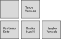

# CourseUpdate

**Properties:**

- [Course](#course)
  - [courseName](#coursename)
  - [gradeLevel](#gradelevel)
  - [classNumber](#classnumber)
  - [deskRows](#deskrows)
  - [deskColumns](#deskcolumns)
  - [deskAt](#deskat)
  - [*enrollment*](#enrollment)
  - [Validation Notes](#validation-notes)
  - [Example Object](#example-object)

**Example:**
If the highest assigned attendance number for a student was `6`, this will be set to `7`.

**Type:** [GradeLevel](../types.md#gradelevel)

**Example:**
`"中2"`

## courseName

The internationalized name of the course.

**Type:** [I18nNameToken](I18nNameToken.md)

**Example:**
See [the example in I18nNameToken](I18nNameToken.md#example-object)

## classNumber

The class number, or 組, of this class.

**Type:** string

**Example:**
`"A"`, `"1"`

**Note:** This chould be limited to a single letter or number.

## deskRows

However many rows of desks are in the classroom.

**Type:** number

**Example:**
`6`

## deskColumns

However many columns of desks are in the classroom.

**Type:** number

**Example:**
`6`

## deskAt

A 2D array representing the grid arrangment of desks in a classroom, where the first represents the row, and the second the column.

Note that rows are ordered from bottom to top, while columns are ordered left to right. Furthermore, an empty object `{}` represents a spot where there is no desk.

**Type:** [Desk](./Desk.md) | [DeskTemplate](./DeskTemplate.md) | {}

**Example:**

Here is an example course where a 5th student is added to a course with 4 students and 5 desks.



[TODO change the current students to ]

```json
[[
    {"@type": ["Desk"], "assignedTo":{
        "@type": ["Student"],
        "givenNames": [{
          "annotation": "ケンタロ",
          "nameToken": {"en": "Kentaro", "ja": "健太郎"}
        }],
        "familyNames": [{
          "annotation": "サトウ",
          "nameToken": {"en": "Satou", "ja": "佐藤"}
        }],
    }},
    {"@type": ["Desk"], "assignedTo":{
        "@type": ["Student"],
        "givenNames": [{
          "annotation": "マリコ",
          "nameToken": {"en": "Mariko", "ja": "まり子"}
        }],
        "familyNames": [{
          "annotation": "スズキ",
          "nameToken": {"en": "Suzuki", "ja": "鈴木"}
        }],
    }},
    {"@type": ["Desk"], "assignedTo":{
        "@type": ["Student"],
        "givenNames": [{
          "annotation": "ハナコ",
          "nameToken": {"en": "Hanako", "ja": "花子"}
        }],
        "familyNames": [{
          "annotation": "ヤマダ",
          "nameToken": {"en": "Yamada", "ja": "山田"}
        }],
    }}
  ], [
    {"@type": ["Desk"]},
    {"@type": ["Desk"], "assignedTo":{
        "@type": ["Student"],
        "givenNames": [{
          "annotation": "タロウ",
          "nameToken": {"en": "Tarou", "ja": "太郎"}
        }],
        "familyNames": [{
          "annotation": "ヤマダ",
          "nameToken": {"en": "Yamada", "ja": "山田"}
        }],
    }},
    {}
  ]
]
```

## *enrollment*

An array representing a set of students enrolled in the course.

**Type:** [Student](./Student.md) & [IdentifiedNode](./IdentifiedNode.md)[]

**Example:**

See [the example in Student](Student.md#example-object)

**Notes:** 
- All students in this array must be assigned a desk.
- Students are assigned attendance numbers (the final two digits of their IRI) in order of Student.familyName.annotation, and then by Student.givenName.annotation

## gradeLevel

The Japanese grade level of the course.

**Type:** [GradeLevel](../types.md#gradelevel)

**Example:**
`"中2"`

## Validation Notes

The object is considered invalid if:

- The enrolled students are all not assigned a desk.

## Example Object

```json
[
  {
    "@id": "https://.../api/course/NTE4NjU1NjAxNDM1/",
    "courseName": {
      "ja": "英語",
      "en": "English"
    },
    "gradeLevel": "中1",
    "classNumber": 1,
    "deskRows": 3,
    "deskColumns": 3,
    "deskAt": [[
      {"@type": ["Desk"], "assignedTo": "https://.../api/course/NTE4NjU1NjAxNDM1/student/01/"},
      {"@type": ["Desk"], "assignedTo": "https://.../api/course/NTE4NjU1NjAxNDM1/student/03/"},
      {"@type": ["Desk"], "assignedTo": "https://.../api/course/NTE4NjU1NjAxNDM1/student/05/"}
    ], [
      {"@type": ["Desk"], "assignedTo": "https://.../api/course/NTE4NjU1NjAxNDM1/student/02/"},
      {"@type": ["Desk"], "assignedTo": "https://.../api/course/NTE4NjU1NjAxNDM1/student/04/"},
      {"@type": ["Desk"]},
    ], [
      {},
        {"@type": ["Desk"], "assignedTo": {
        "givenName": {
            "annotation": "マリコ",
            "nameToken": {"en": "Mariko", "ja": "まり子"}
        },
        "familyName": {
            "annotation": "スズキ",
            "nameToken": {"en": "Suzuki", "ja": "鈴木"}
        },
      }},
      {}
    ]],
    "enrollment": [
      {
        "@id": "https://.../api/course/NTE4NjU1NjAxNDM1/student/01/",
        "@type": ["Student"],
        "givenNames": [{
          "annotation": "ケンタロ",
          "nameToken": {"en": "Kentaro", "ja": "健太郎"}
        }],
        "familyNames": [{
          "annotation": "サトウ",
          "nameToken": {"en": "Satou", "ja": "佐藤"}
        }],
        "attendanceSummary": {
          "absences": 0,
          "lates": 2,
          "excused": 4
        }
      },
      {
        "@id": "https://.../api/course/NTE4NjU1NjAxNDM1/student/02/",
        "@type": ["Student"],
        "givenNames": [{
          "annotation": "マリコ",
          "nameToken": {"en": "Mariko", "ja": "まり子"}
        }],
        "familyNames": [{
          "annotation": "スズキ",
          "nameToken": {"en": "Suzuki", "ja": "鈴木"}
        }],
        "attendanceSummary": {
          "absences": 0,
          "lates": 0,
          "excused": 0
        }
      },
      { 
        "@id": "https://.../api/course/NTE4NjU1NjAxNDM1/student/03/",
        "@type": ["Student"],
        "givenNames": [{
          "annotation": "ユウ",
          "nameToken": {"en": "Yuu", "ja": "ゆう"}
        }],
        "familyNames": [{
          "annotation": "タナカ",
          "nameToken": {"en": "Tanaka", "ja": "田中"}
        }],
        "attendanceSummary": {
          "absences": 0,
          "lates": 0,
          "excused": 0
        }
      },
      {
        "@id": "https://.../api/course/NTE4NjU1NjAxNDM1/student/04/",
        "@type": ["Student"],
        "givenNames": [{
          "annotation": "タロウ",
          "nameToken": {"en": "Tarou", "ja": "太郎"}
        }],
        "familyNames": [{
          "annotation": "ヤマダ",
          "nameToken": {"en": "Yamada", "ja": "山田"}
        }],
        "attendanceSummary": {
          "absences": 0,
          "lates": 0,
          "excused": 2
        }
      },
      {
        "@id": "https://.../api/course/NTE4NjU1NjAxNDM1/student/05/",
        "@type": ["Student"],
        "givenName": {
          "annotation": "ハナコ",
          "nameToken": {"en": "Hanako", "ja": "花子"}
        },
        "familyName": {
          "annotation": "ヤマダ",
          "nameToken": {"en": "Yamada", "ja": "山田"}
        },
        "attendanceSummary": {
          "absences": 0,
          "lates": 1,
          "excused": 0
        }
      }
    ]
  }
]
```
