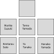

# /api/course

Summary data about the collection of courses being taught by a user.

- [/api/course](#apicourse)
  - [I/O](#io)
  - [Request Headers](#request-headers)
  - [Request Body](#request-body)
  - [Response Headers](#response-headers)
  - [Response Body](#response-body)
  - [Request Example](#request-example)
  - [Response Body Example](#response-body-example)

## I/O

Create a new [Course](../classes/Course.md) resources by POSTing a [CourseTemplate](../classes/CourseTemplate.md), or GET a list of [Course](../classes/Course.md)s

**URL:** /api/course

**Methods:** GET, POST

Get a summary of the user's courses.

## Request Headers

| Key      | Values                                    | Notes                      |
|----------|-------------------------------------------|----------------------------|
| `Accept` | `application/ld+json`, `application/json` | Optional. Defaults to JSON |

## Request Body

**Type:** [CourseTemplate](../classes/CourseTemplate.md) & [BlankNode](../classes/BlankNode.md)

## Response Headers

| Key      | Values                                                                          |
|----------|---------------------------------------------------------------------------------|
|`Location`|`https://.../api/course/{course-id}`                                             |
|`Link`    |`<https://.../api/course/{course-id}/student/{student-id}>; rel="enrollment",...`|

## Response Body

**Type:** [Course](../classes/Course.md) & [IdentifiedNode](../classes/IdentifiedNode.md)

**Notes:**

- Students are assigned attendance numbers (the final two digits of their IRI) in order of Student.familyName.annotation, and then by Student.givenName.annotation

## Request Example

Consider the case of a JHS first year course called "英語" in Japanese, and "English" in English. The seating plan is as follows.



The request body for this class setup would look like this:

```json
{
  "@type": ["Course"],
  "courseName": {
    "ja": "英語",
    "en": "English"
  },
  "gradeLevel": "中1",
  "classNumber": 1,
  "deskRows": 3,
  "deskColumns": 3,
  "deskAt": [[
      {"@type": ["Desk"], "assignedTo":{
         "@type": ["Student"],
         "givenNames": [{
           "annotation": "ケンタロ",
           "nameToken": {"en": "Kentaro", "ja": "健太郎"}
         }],
         "familyNames": [{
           "annotation": "サトウ",
           "nameToken": {"en": "Satou", "ja": "佐藤"}
         }],
      }},
      {"@type": ["Desk"], "assignedTo":{
         "@type": ["Student"],
         "givenNames": [{
           "annotation": "ユウ",
           "nameToken": {"en": "Yuu", "ja": "ゆう"}
         }],
         "familyNames": [{
           "annotation": "タナカ",
           "nameToken": {"en": "Tanaka", "ja": "田中"}
         }],
      }},
      {"@type": ["Desk"], "assignedTo":{
         "@type": ["Student"],
         "givenNames": [{
           "annotation": "ハナコ",
           "nameToken": {"en": "Hanako", "ja": "花子"}
         }],
         "familyNames": [{
           "annotation": "ヤマダ",
           "nameToken": {"en": "Yamada", "ja": "山田"}
         }],
      }}
   ], [
      {"@type": ["Desk"], "assignedTo":{
         "@type": ["Student"],
         "givenNames": [{
           "annotation": "マリコ",
           "nameToken": {"en": "Mariko", "ja": "まり子"}
         }],
         "familyNames": [{
           "annotation": "スズキ",
           "nameToken": {"en": "Suzuki", "ja": "鈴木"}
         }],
      }},
      {"@type": ["Desk"], "assignedTo":{
         "@type": ["Student"],
         "givenNames": [{
            "annotation": "タロウ",
            "nameToken": {"en": "Tarou", "ja": "太郎"}
         }],
         "familyNames": [{
            "annotation": "ヤマダ",
            "nameToken": {"en": "Yamada", "ja": "山田"}
         }],
      }},
      {"@type": ["Desk"]}
   ], [
      {},
      {"@type": ["Desk"]},
      {}
   ]]
}
```

## Response Body Example

```json
[
  {
    "@id": "https://.../api/course/NTE4NjU1NjAxNDM1/",
    "courseName": {
      "ja": "英語",
      "en": "English"
    },
    "gradeLevel": "中1",
    "classNumber": 1,
    "deskRows": 3,
    "deskColumns": 3,
    "deskAt": [[
      {"@type": ["Desk"], "assignedTo": "https://.../api/course/NTE4NjU1NjAxNDM1/student/01/"},
      {"@type": ["Desk"], "assignedTo": "https://.../api/course/NTE4NjU1NjAxNDM1/student/03/"},
      {"@type": ["Desk"], "assignedTo": "https://.../api/course/NTE4NjU1NjAxNDM1/student/05/"}
    ], [
      {"@type": ["Desk"], "assignedTo": "https://.../api/course/NTE4NjU1NjAxNDM1/student/02/"},
      {"@type": ["Desk"], "assignedTo": "https://.../api/course/NTE4NjU1NjAxNDM1/student/04/"},
      {"@type": ["Desk"]},
    ], [
      {},
      {"@type": ["Desk"]},
      {}
    ]],
    "enrollment": [
      {
        "@id": "https://.../api/course/NTE4NjU1NjAxNDM1/student/01/",
        "@type": ["Student"],
        "givenNames": [{
          "annotation": "ケンタロ",
          "nameToken": {"en": "Kentaro", "ja": "健太郎"}
        }],
        "familyNames": [{
          "annotation": "サトウ",
          "nameToken": {"en": "Satou", "ja": "佐藤"}
        }],
        "attendanceSummary": {
          "absences": 0,
          "lates": 2,
          "excused": 4
        }
      },
      {
        "@id": "https://.../api/course/NTE4NjU1NjAxNDM1/student/02/",
        "@type": ["Student"],
        "givenNames": [{
          "annotation": "マリコ",
          "nameToken": {"en": "Mariko", "ja": "まり子"}
        }],
        "familyNames": [{
          "annotation": "スズキ",
          "nameToken": {"en": "Suzuki", "ja": "鈴木"}
        }],
        "attendanceSummary": {
          "absences": 0,
          "lates": 0,
          "excused": 0
        }
      },
      { 
        "@id": "https://.../api/course/NTE4NjU1NjAxNDM1/student/03/",
        "@type": ["Student"],
        "givenNames": [{
          "annotation": "ユウ",
          "nameToken": {"en": "Yuu", "ja": "ゆう"}
        }],
        "familyNames": [{
          "annotation": "タナカ",
          "nameToken": {"en": "Tanaka", "ja": "田中"}
        }],
        "attendanceSummary": {
          "absences": 0,
          "lates": 0,
          "excused": 0
        }
      },
      {
        "@id": "https://.../api/course/NTE4NjU1NjAxNDM1/student/04/",
        "@type": ["Student"],
        "givenNames": [{
          "annotation": "タロウ",
          "nameToken": {"en": "Tarou", "ja": "太郎"}
        }],
        "familyNames": [{
          "annotation": "ヤマダ",
          "nameToken": {"en": "Yamada", "ja": "山田"}
        }],
        "attendanceSummary": {
          "absences": 0,
          "lates": 0,
          "excused": 2
        }
      },
      {
        "@id": "https://.../api/course/NTE4NjU1NjAxNDM1/student/05/",
        "@type": ["Student"],
        "givenName": {
          "annotation": "ハナコ",
          "nameToken": {"en": "Hanako", "ja": "花子"}
        },
        "familyName": {
          "annotation": "ヤマダ",
          "nameToken": {"en": "Yamada", "ja": "山田"}
        },
        "attendanceSummary": {
          "absences": 0,
          "lates": 1,
          "excused": 0
        }
      }
    ],
    "newAttendanceNumberIndex": 6
  }
]
```
